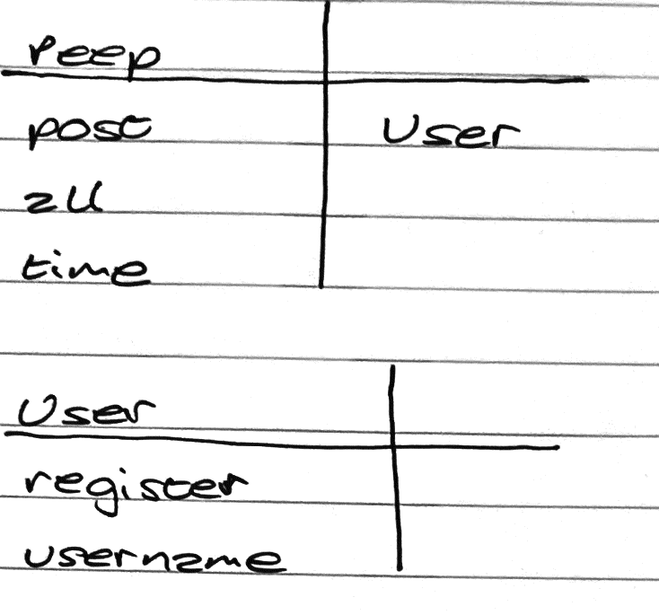

# Chitter #

Chitter is a Twitter clone made to test my experience with web apps and
databases. Users can register, login, log out of accounts, and post peeps.


## User Stories ##
```
As a Maker
So that I can let people know what I am doing  
I want to post a message (peep) to chitter

As a maker
So that I can see what others are saying  
I want to see all peeps in reverse chronological order

As a Maker
So that I can better appreciate the context of a peep
I want to see the time at which it was made

As a Maker
So that I can post messages on Chitter as me
I want to sign up for Chitter
```

### CRC Cards ###


## Dependancies ##
* Capybara
* PG
* Rspec
* Rubocop
* Simplecov
* Simplecov-Console
* Sinatra

*NOTE: These can be installed by running `bundle` in the root of the directory.*

## How to Use ##
1. Open Terminal and clone the repository:
```bash
git clone https://github.com/aimeecraig/chitter-challenge.git
```
2. Change into the project directory:
```bash
cd chitter-challenge
```
3. Install the dependancies:
```bash
bundle install
```
4. Run the program:
```bash
rackup
```
5. Access the program from `localhost:9292`.

6. Create the database to store the bookmarks by following the steps below.

7. Run the Rspec tests to ensure the program is functioning correctly:
```bash
rspec
```

### Create the Databases ###
You will need to create two databases in order to test the program.

1. In Terminal, connect to PostgreSQL:
```sql
psql
```
2. Create the database:
```sql
CREATE DATABASE chitter;
```
3. Connect to the database:
```sql
\c chitter;
```
4. Run the query in db/migrations/01_create_peeps_table.sql:
```sql
CREATE TABLE peeps(id SERIAL PRIMARY KEY, message VARCHAR(140));
```
5. Run the query in db/migrations/02_create_users_table.sql:
```sql
CREATE TABLE users(id SERIAL PRIMARY KEY, name VARCHAR(60));
```
6. Follow steps 2-5 again, this time naming the database to `chitter_test`.
